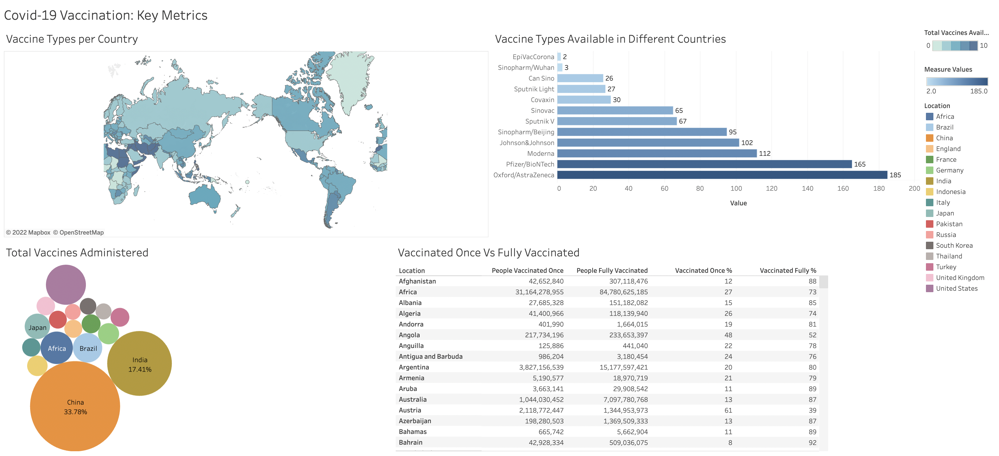

# COVID 19 Vaccination Dashboard

## Overview
Following is Tableau Dashboard representing key metrics on the coronavirus vaccines.

## Description
The COVID-19 Vaccine Dashboard features data detailing the different types of vaccines available in different countries, including first and second doses, county-level distribution. With the dashboard, you can track important trends and performance goals for specified geographies, and tabulate vaccine distribution parameters.

## [Dashboard](https://public.tableau.com/app/profile/aakansha.goyal/viz/Covid19Vaccination_16672541328040/Dashboard1)

### [Source](https://github.com/owid/covid-19-data/tree/master/public/data/vaccinations)

### [Reference](https://www.analyticsvidhya.com/blog/2021/04/building-a-covid-19-vaccination-dashboard-in-tableau/)